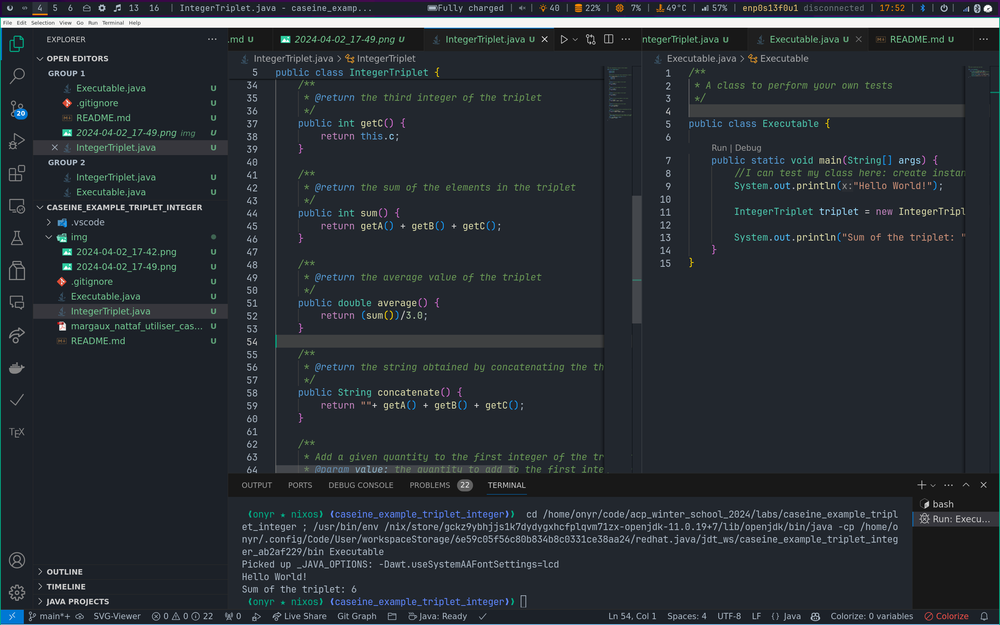
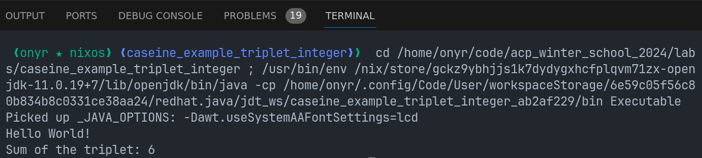
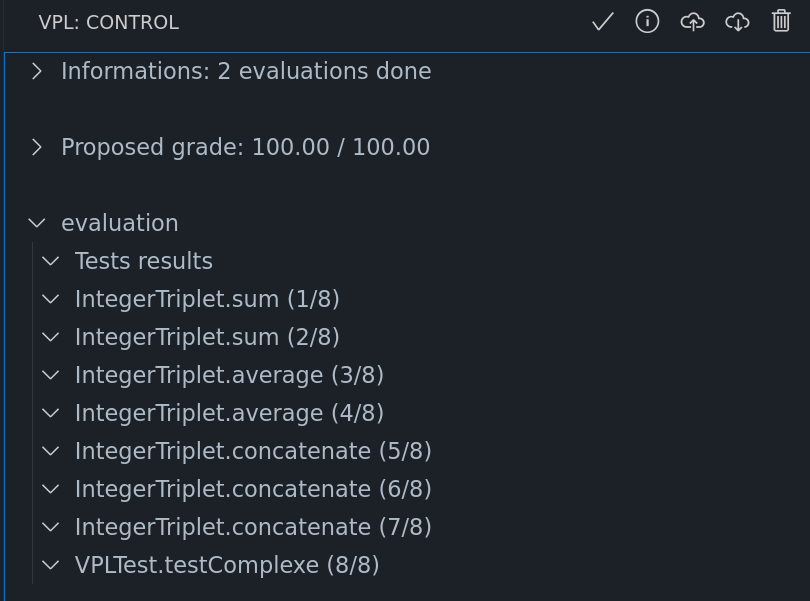

# Utiliser Caseine avec VScode

> Ce repository est un exemple d'utilisation de Caseine avec VScode.

Obtain you VPL link at: [a simple example : Triplet of integers (Java) | Caseine](https://moodle.caseine.org/mod/vpl/views/show_webservice.php?id=17142)

Below is an example of using Caseine on NixOs-i3:

### Use Caseine

1. In VSCode, install the `perelabat.vpl` extension.
2. Obtain you VPL link at: [a simple example : Triplet of integers (Java) | Caseine](https://moodle.caseine.org/mod/vpl/views/show_webservice.php?id=17142). Click on the Caseine shortcut icon and paste the URL of the caseine lab.
3. Download the code with the VPL: control "Pull" button.
4. Edit the code.
5. Run locally using the VPL: control "▷" button (right corner of the "Executable.java" window. This opens a terminal and execute the code.

6. Run remote test and see the results, using the VPL: control "✓" button.

### Tips

> [!WARNING]
>
> When working with Git, don't forget to add a `.gitignore` file with the `vpl.json` file red-flagged since it contains you personal access token.
